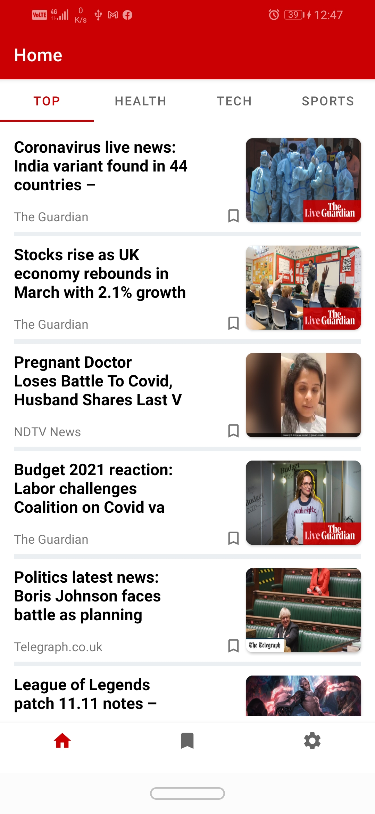
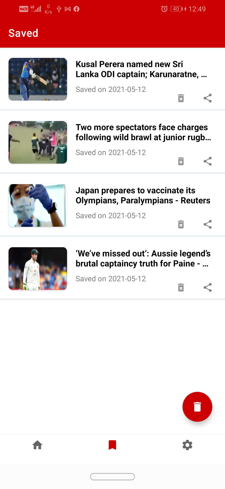
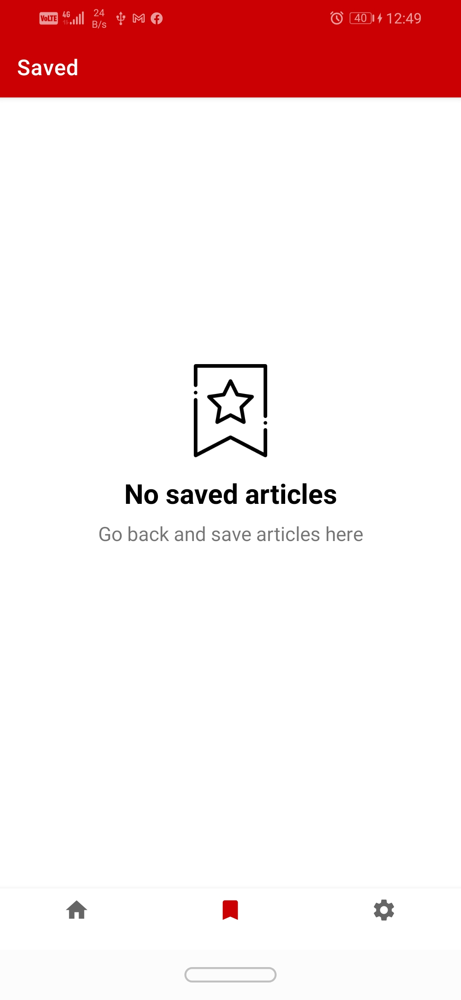
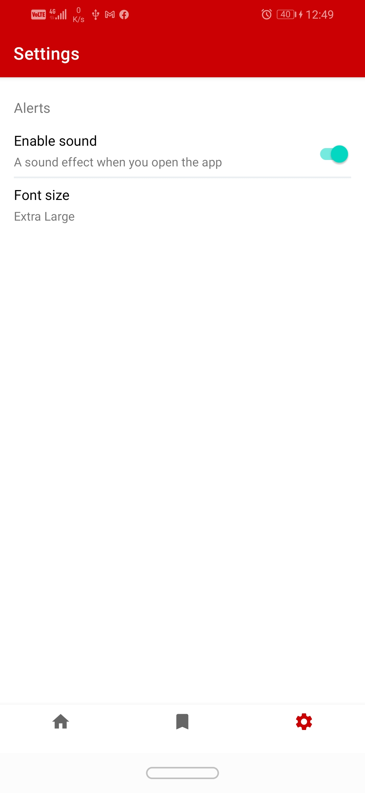
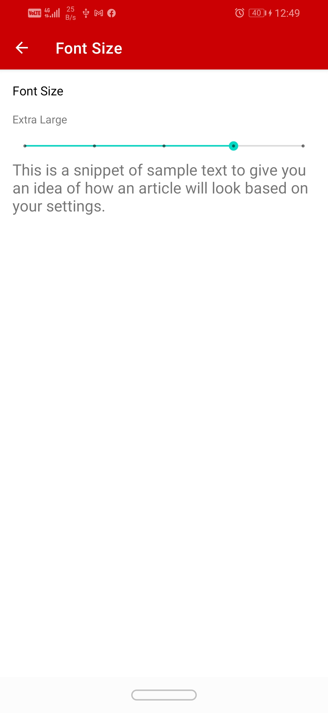
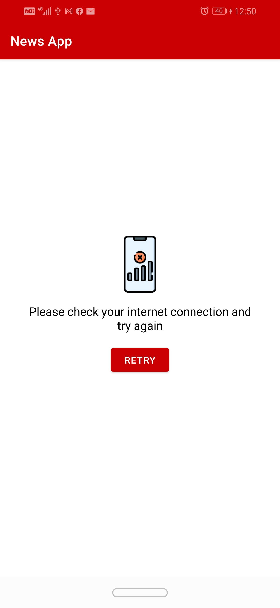
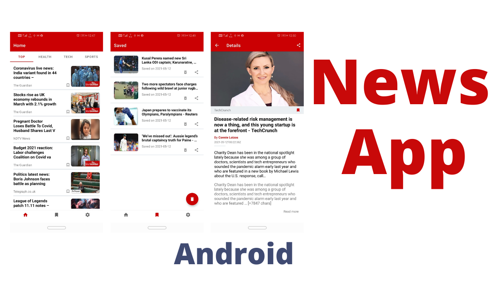

# News App


## Table of contents
* [General info](#general-info)
* [Screenshots](#screenshots)
* [Technologies](#technologies)
* [Setup](#setup)
* [YouTube Link](#youtube-link)
* [License](#license)

## General info

This android app created with google api news, Included with four categories: top, health,
tech and sports, Implemented with SOLID principal and clean code.

## Screenshots

 






## Technologies

#### Languages:
- Kotlin 
- Xml

#### Architecture patterns:
- MVVM

#### Libraries:
- Retrofit  2.9.0 (https://square.github.io/retrofit/)
- Gson      2.9.6 (https://github.com/google/gson)
- Room      2.4.2 (https://developer.android.com/training/data-storage/room)
- Glide     4.13.0 (https://github.com/bumptech/glide)
- Coroutine 1.6.1 (https://developer.android.com/kotlin/coroutines)
- Paging    3.1.1 (https://developer.android.com/topic/libraries/architecture/paging/v3-overview)
- Hilt      2.40.1 (https://developer.android.com/training/dependency-injection/hilt-android)
- ViewPager 1.0.0 (https://developer.android.com/jetpack/androidx/releases/viewpager2)
- ViewModel, LiveData, Viewbinding 2.4.1 (https://developer.android.com/jetpack/androidx/releases/lifecycle)

## Setup

To run this project, install it by download or clone.
Then you need to register a new account
in news api website (https://newsapi.org/s/google-news-api) 
to aquire api key for your app.

#### System requirements
- Android Studio Chipmunk | 2021.2.1
- Minimum sdk v21
- Build tool v30.0.3
- Compile sdk v32

## YouTube link 



(https://www.youtube.com/watch?v=DF-tLjI5BYQ)

## License

```html
MIT Licence 

Copyright (c) 2021 Ahmed Zaki

Permission is hereby granted, free of charge, to any person obtaining a copy of this software
and associated documentation files (the "Software"), to deal in the Software without restriction,
including without limitation the rights to use, copy, modify, merge, publish, distribute, sublicense,
and/or sell copies of the Software, and to permit persons to whom the Software is furnished to do so, 
subject to the following conditions:

The above copyright notice and this permission notice shall be included in all copies or substantial 
portions of the Software.

THE SOFTWARE IS PROVIDED "AS IS", WITHOUT WARRANTY OF ANY KIND, EXPRESS OR IMPLIED, 
INCLUDING BUT NOT LIMITED TO THE WARRANTIES OF MERCHANTABILITY, FITNESS FOR A PARTICULAR PURPOSE
AND NONINFRINGEMENT.IN NO EVENT SHALL THE AUTHORS OR COPYRIGHT HOLDERS BE LIABLE FOR ANY CLAIM,
DAMAGES OR OTHER LIABILITY, WHETHER IN AN ACTION OF CONTRACT,
TORT OR OTHERWISE, ARISING FROM, OUT OF OR IN CONNECTION WITH THE SOFTWARE
OR THE USE OR OTHER DEALINGS IN THE SOFTWARE.
```
